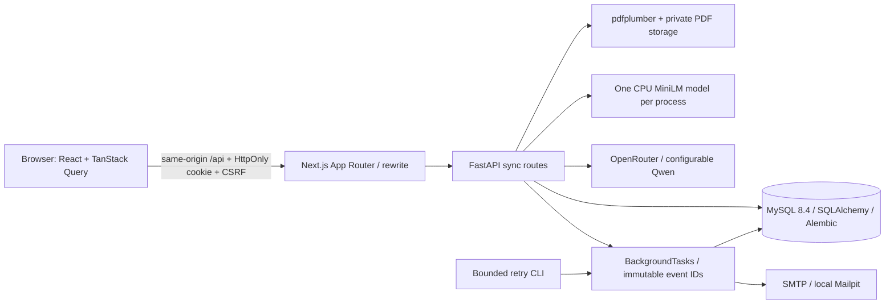
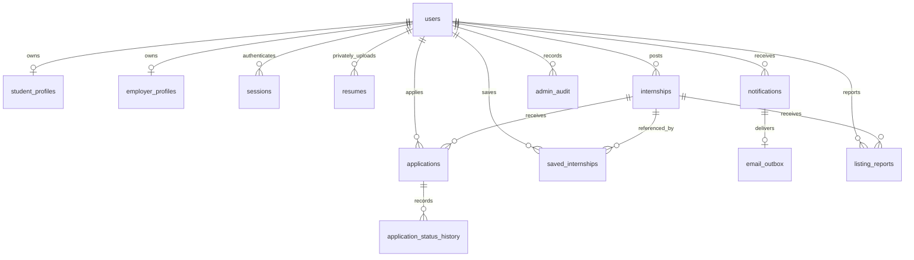

# Architecture and retention

Tables are lowercase, foreign-key constrained, and use UTF-8 MB4. JSON columns hold validated lists and objects; stipends use DECIMAL(12,2). UTC is stored as naive MySQL DATETIME at second precision and rendered as ISO 8601 with `Z`. Unique keys enforce normalized email, one application/save per pair, one history entry per application version, and one notification/email per event. No startup `create_all`, destructive seed, or automatic migration occurs.

Opaque session tokens contain 320 bits of random input; only SHA-256 token hashes enter MySQL. Cookies are HttpOnly, SameSite=Lax, path `/`, with configurable expiry/Secure. Anonymous sessions bootstrap CSRF protection before login or signup. Every mutation, including login/logout, checks an exact Origin allowlist and a session-bound token in `X-CSRF-Token`. Authentication rotates the browser's previous session. Password change/deactivation revoke all sessions. Email changes require current password and rotate all sessions. Roles are immutable after signup.

All role and ownership rules execute in FastAPI. Employers receive only application-time profile snapshots for their own listings. PDFs, raw text and unrelated student profiles are never available to employers. Request/validation errors omit input values. Server logs contain no passwords, resume bodies, provider responses or connection strings. A bounded per-IP login/upload limiter runs in a thread-safe in-memory sliding window; it is single-process and intentionally ignores untrusted forwarded IP headers.

Routes use synchronous `def`, so FastAPI dispatches blocking SQLAlchemy/PDF/CPU work into its thread pool. Model initialization has a process lock and bounded content-hash cache. Slow moderation/feedback/email services first read immutable data in their own session and close it, then call the model/SMTP, then reopen a short write transaction. A version check prevents stale moderation from publishing changed/closed/deleted listings.

Application status writes lock the application, validate version/transition, and atomically commit the new status, history, notification and outbox. Background execution uses new DB sessions and immutable event IDs. A terminal status is immutable; repeating the current status is a no-op even with an older version. Cover edits increment the optimistic version but do not create status history entries. Withdrawal preserves records and blocks reapplication.

Resume uploads create drafts tied to the current profile version. Confirmation merges reviewed new entries and records their provenance. Manual preexisting entries are preserved by the explicit clear-derived action. Deleting a PDF removes private bytes and the resume row and clears confirmed raw text; confirmed structured entries remain until the student edits them or chooses clear-derived. There is no OCR. Private storage is outside frontend/public; randomized names and owner-only download prevent path traversal and public access.

Deactivation removes resume files/rows and private profile data, anonymizes the user's name/email, clears their application snapshots/cover messages, suppresses unsent emails, revokes sessions, and closes employer listings. IDs, listing references, statuses, timestamps and decision history are retained for integrity. This capstone does not impose an automatic retention period; a deployment operator must choose a policy before real-world use. Already delivered messages in a recipient's mailbox cannot be recalled.

The outbox claims pending work using row locks and a committed `sending` lease; other workers skip fresh claims. Retry count and sanitized failure metadata are visible separately from the application status. Delivery is at-least-once under crash recovery, not exactly once. Ten-minute leases exceed the configured bounded provider and SMTP timeouts. Retry commands can be invoked after a local restart without introducing Celery/Redis.
